---
# 不羁的方言比较——地理语言学小站
---

**[方音圖鑒](https://dialects.yzup.top/)**
访问「方音圖鑒」首页：[🔗 dialects.yzup.top](https://dialects.yzup.top/)

[](https://www.python.org)
[](LICENSE)

> 漢字方言音典數據預處理系統，支持多種字表格式轉換、音韻數據提取與 SQLite 數據庫構建

---

## 📚 目錄

- [項目簡介](#項目簡介)
- [適用對象](#適用對象)
- [相關倉庫](#相關倉庫)
- [項目結構](#項目結構)
- [核心功能](#核心功能)
- [快速開始](#快速開始)
  - [方式一：使用示例數據（推薦新手）](#方式一使用示例數據推薦新手)
  - [方式二：處理自己的數據](#方式二處理自己的數據)
- [安裝指南](#安裝指南)
- [使用說明](#使用說明)
  - [主腳本：build.py](#主腳本buildpy)
  - [輔助腳本：utils.py](#輔助腳本utilspy)
- [數據庫架構](#數據庫架構)
- [配置文件](#配置文件)
- [數據處理流程](#數據處理流程)
- [常見問題](#常見問題)
- [性能優化](#性能優化)
- [許可證](#許可證)
- [致謝](#致謝)

---

## 項目簡介

**方音圖鑒字表預處理工具**是一個用於處理漢字方言音典數據的工業級 ETL 系統。它可以：

- 📄 **支持多種格式**：Excel (.xlsx/.xls)、Word (.docx)、TSV/CSV 等
- 🎵 **提取音韻信息**：自動識別聲母、韻母、聲調，支持 IPA 和粵拼
- 🗄️ **構建數據庫**：生成優化的 SQLite 數據庫，支持百萬級數據查詢
- 🌏 **地理坐標**：自動轉換百度坐標到 GCJ-02（火星坐標系）/WGS84坐標系
- 🔤 **簡繁轉換**：基於正字表和 OpenCC 的多層級轉換
- ⚡ **高性能處理**：批量插入、內存日志、復合索引優化

### 數據庫結構

生成三個核心數據庫（根據用戶模式不同，生成不同文件）：

1. **characters.db**：存儲每個漢字的中古地位
   - 文件名：`characters.db`（admin 和 user 模式共用）
   - 欄位：["攝", "呼", "等", "韻", "入", "調", "清濁", "系", "組", "母", "部位", "方式", "漢字", "釋義", "多地位標記", "多聲母", "多等", "多韻", "多調"]

2. **方言音韻數據庫**（概念名稱：dialects_all.db）
   - Admin 模式：`dialects_admin.db`
   - User 模式：`dialects_user.db`
   - 內容：每個方言點的聲韻調信息
   - 欄位：["簡稱", "漢字", "音節", "聲母", "韻母", "聲調", "註釋", "多音字"]
   - 注意：文件較大（可能數 GB），實際使用時可能需要移動到其他路徑

3. **方言查詢數據庫**（概念名稱：dialects_query.db）
   - Admin 模式：`query_admin.db`
   - User 模式：`query_user.db`
   - 內容：地理信息、經緯度、行政區劃、調值、分區等元數據
   - 包含地理信息、聲調系統（T1~T10）、行政區劃等多個欄位

### 性能指標

- 處理速度：2000 個方言點，600 萬條數據
- **優化前**：~120 分鐘
- **優化後**：~15-20 分鐘
- **提速**：6-8 倍

---

## 項目結構

```
chars/
├── build.py                    # 主入口：數據預處理管道
├── utils.py                    # 輔助工具入口
├── requirements.txt            # Python 依賴
├── CLAUDE.md                   # Claude Code 項目指南
│
├── source/                     # 核心處理模塊
│   ├── raw2tsv.py             # 格式轉換調度器
│   ├── format_convert.py      # 三種格式處理器（音典/跳跳老鼠/縣志）
│   ├── process_tones.py       # 聲調提取與轉換
│   ├── tsv2sql.py             # 數據庫寫入與查詢庫構建
│   ├── mcp_export.py          # MCPDict 音典數據拉取與導出
│   ├── convert_jyut.py        # 粵拼轉 IPA
│   ├── match_fromdb.py        # 字符衝突解決
│   ├── change_coordinates.py  # 坐標系轉換（百度→GCJ-02）
│   ├── get_new.py             # 音韻數據提取
│   └── check/                 # 非交互式檢查工具
│       ├── sheet.py           # 音典字表變動檢查
│       ├── match.py           # TSV 文件名與簡稱匹配檢查
│       └── tone_check.py      # xlsx 聲調欄檢查
│
├── common/                     # 共享工具
│   ├── config.py              # 路徑配置與數據庫定義
│   ├── constants.py           # 常量與排除列表
│   ├── s2t.py                 # 簡繁轉換（多層級）
│   └── search_tones.py        # 聲調搜索工具
│
├── scripts/                    # 輔助腳本
│   ├── check/                 # 字表校驗（五重檢查）
│   │   ├── checks.py          # 主檢查流程
│   │   ├── match_input_tip.py # 輸入提示匹配
│   │   ├── maybe_error_chars.py # 錯字檢測
│   │   ├── process_sp_input.py  # 特殊輸入處理
│   │   ├── status_arrange_pho.py # 音韻狀態整理
│   │   └── xlsx2tsv.py        # Excel 轉 TSV
│   │
│   ├── jyut2ipa/              # 粵拼轉換
│   │   └── replace.py         # 批量粵拼→IPA
│   │
│   ├── merge/                 # 字表合併
│   │   └── wordsheet_merge.py # 多字表合併工具
│   │
│   ├── sql/                   # 數據庫工具
│   │   ├── init_wal_files.py # WAL 模式初始化
│   │   ├── write2sql.py       # 數據寫入
│   │   ├── write_index.py     # 索引創建
│   │   └── write_yubao.py     # 語保數據寫入
│   │
│   ├── export/                # 數據導出
│   │   ├── fanwan_sql_to_xlsx.py      # 數據庫導出為 Excel
│   │   └── process_ancient_pinyin.py  # 上古音數據處理
│   │
│   └── utils/                 # 維護工具
│       ├── cleanup_duplicates.py  # 清理重複文件
│       ├── compare_yindian.py     # 比較 yindian 目錄差異
│       └── test_coordinate_conversion.py # 坐標轉換測試
│
├── data/                       # 數據目錄
│   ├── raw/                   # 原始字表文件
│   ├── processed/             # 處理後的 TSV（admin 模式）
│   ├── yindian/               # 音典 TSV（user 模式）
│   ├── dependency/            # 依賴數據
│   │   ├── jengzang補充.xlsx  # 核心配置文件（必需）
│   │   ├── 聲韻.xlsx          # 中古音地位表（必需）
│   │   ├── 正字.tsv           # 簡繁轉換表（可選）
│   │   ├── 上古漢語.xlsx      # 上古音數據
│   │   ├── 上古汉语音节表.xlsx # 上古音節表
│   │   ├── 王三全字表（小韻內部未校）+3.3.xlsx # 王力音韻數據
│   │   ├── 王三反切音韻地位表.csv # 反切音韻地位
│   │   ├── 中原音韻.tsv       # 中原音韻數據
│   │   ├── 洪武正韻.xlsx      # 洪武正韻數據
│   │   ├── 分韻撮要.xlsx      # 分韻撮要數據
│   │   └── 蒙古字韻.tsv       # 蒙古字韻數據
│   ├── *.db                   # 生成的數據庫文件
│   └── images/                # README 圖片
│
└── logs/                       # 日誌目錄
    ├── 缺資料.txt
    ├── write.txt
    └── write_error.txt
```

### 核心文件說明

**主入口**：
- `build.py`：數據預處理主流程，支持 admin/user 模式
- `utils.py`：輔助工具調度器，調用 scripts/ 下的各種工具

**source/ 模塊**：
- `raw2tsv.py`：識別字表格式並調度對應處理器
- `format_convert.py`：包含三種格式的處理函數
- `tsv2sql.py`：數據庫操作核心（寫入、查詢庫構建、同步）
- `mcp_export.py`：拉取 MCPDict 音典資料，支持全量、增量與歷史導出
- `process_tones.py`：聲調映射與轉換邏輯
- `source/check/`：非交互式檢查入口，包括音典字表變動、TSV 文件名匹配與聲調欄檢查

**scripts/ 工具**：
- `check/`：交互式字表校驗系統（5 步檢查）
- `jyut2ipa/`：粵拼批量轉換工具
- `merge/`：多字表合併工具
- `sql/`：數據庫初始化與索引管理
- `export/`：數據導出與上古音處理
- `utils/`：文件比較、清理、測試等維護工具

---

## 適用對象

本工具適合以下用戶：

- 🎓 **語言學研究者**：需要處理方言調查數據、構建音韻數據庫
- 📊 **數據科學家**：需要分析漢語方言的音韻模式和地理分布
- 💻 **開發者**：需要為語言學應用提供方言數據支持
- 📚 **方言愛好者**：想要整理和分析自己收集的方言資料

### 前置知識

**必需**：
- 基本的命令行操作
- Python 環境配置

**推薦**（但非必需）：
- 漢語音韻學基礎（了解聲母、韻母、聲調概念）
- IPA 國際音標基礎
- Excel 操作

**不需要**：
- 編程經驗（工具已封裝好）
- 數據庫知識（自動生成）

---

## 相關倉庫

### 相關倉庫一覽

- **[後端 - Dialects Backend](https://github.com/jengzang/dialects-backend)**
  [](https://github.com/jengzang/dialects-backend)

- **[前端 - Dialects JS Frontend](https://github.com/jengzang/dialects-js-frontend)**
  [](https://github.com/jengzang/dialects-js-frontend)

---

## 核心概念與術語

### 音韻學術語

| 術語 | 說明 | 範例 |
|------|------|------|
| **聲母** | 音節開頭的輔音 | "時"字的 t、"詩"字的 ʃ |
| **韻母** | 聲母之後的部分（包含韻腹、韻尾） | "時"字的 i、"山"字的 an |
| **聲調** | 音高變化模式 | 陰平（55）、陽平（21）、上聲（35）等 |
| **IPA** | 國際音標，用於精確標記語音 | [tɕi³³]、[ʃɿ⁵⁵] |
| **粵拼** | 粵語拼音方案（Jyutping） | si4（時）、saa1（沙） |
| **中古音** | 隋唐時期的漢語音系 | 攝、呼、等、韻、調等分類 |

### 字表格式術語

| 格式 | 來源 | 特點 |
|------|------|------|
| **音典** | 漢字音典標準 | 一字一行，最常見 |
| **跳跳老鼠** | 民間整理方式 | 一音多字，節省空間 |
| **縣志** | 地方志書格式 | 聲韻調分表，便於音韻分析 |

### 數據庫術語

| 術語 | 說明 |
|------|------|
| **方言點** | 一個具體的方言調查地點（如：广州、香港） |
| **簡稱** | 方言點的唯一標識符 |
| **多音字** | 同一個字在同一方言點有多個讀音 |
| **文白讀** | 文讀音（書面語）vs 白讀音（口語） |

---

## 核心功能

### 1. 字表格式轉換

支持三種主流字表格式：

| 格式 | 說明 | 範例 |
|------|------|------|
| **音典** | 一字一音，標準音典格式 | `#漢字 音標 解釋` |
| **跳跳老鼠** | 一音多字，按音節分組 | `音節 漢字列表` |
| **縣志** | 分拆表格，按聲韻調分類 | `#韻 聲母 聲調 字` |

### 2. 音韻數據提取

- ✅ 自動識別聲母、韻母、聲調
- ✅ 支持 IPA 國際音標
- ✅ 支持粵拼 (Jyutping) 轉換
- ✅ 多音字自動標記
- ✅ 文白讀音註釋合併

### 3. 數據處理管道

```
原始字表 / MCPDict 音典資料 → 格式識別 → TSV 轉換 → 聲調處理 → 數據提取 → 數據庫寫入 → 索引優化
```

### 4. 數據拉取與檢查

- ✅ 支持從 MCPDict 拉取音典資料：全量、增量、歷史 TSV、歷史 xlsx
- ✅ 支持音典字表變動檢查：新增、改名、刪除與同坐標衝突
- ✅ 支持只輸出「是否有人在做=不收」的記錄
- ✅ 支持 xlsx 聲調欄檢查，列出異常調類與拆解失敗值
- ✅ 支持 TSV 文件名與查詢庫簡稱匹配檢查

---

## 快速開始

### 前置需求

- Python 3.8+
- SQLite 3.x

### 方式一：使用示例數據（推薦新手）

如果你是第一次使用，建議先用示例數據測試：

```bash
# 1. 克隆項目
git clone https://github.com/jengzang/chars.git
cd chars

# 2. 安裝依賴
pip install -r requirements.txt

# 3. 查看示例數據
# 項目已包含示例數據在 data/github示例数据/ 目錄
ls data/github示例数据/

# 4. 驗證安裝（可選）
python -c "import pandas, openpyxl, opencc; print('✓ 依賴安裝成功')"

# 5. 運行示例（如果有配置好的示例）
# 注意：需要確保 data/dependency/jengzang補充.xlsx 中已配置示例數據
python build.py -u user

# 6. 查看生成的數據庫
ls data/*.db
```

**預期結果**：
- 生成 `data/dialects_user.db`（方言音韻數據）
- 生成 `data/query_user.db`（地理元數據）
- 生成 `data/characters.db`（中古音地位）

### 方式二：處理自己的數據

當你熟悉流程後，可以處理自己的方言字表：

```bash
# 1. 準備字表文件
# 將你的 Excel/Word/TSV 文件放入 data/raw/ 目錄
cp 你的字表.xlsx data/raw/

# 2. 配置字表信息
# 編輯 data/dependency/jengzang補充.xlsx
# 填寫以下必填字段：
#   - 簡稱：方言點名稱（如：广州、香港）
#   - 文件名：你的字表文件名（支持通配符 *）
#   - 字表格式：音典 / 跳跳老鼠 / 縣志
#   - 是否有人在做：填 "已做"

# 3. 執行完整預處理
python build.py -u admin -t convert needchars sync chars

# 4. 查看結果
ls data/*.db
```

**字表格式說明**：

| 格式名稱 | 說明 | 範例 |
|---------|------|------|
| **音典** | 一字一行，每行包含：漢字、音標、註釋 | `時 tɕi33 四時也` |
| **跳跳老鼠** | 一音多字，相同讀音的字放在一起 | `tɕi33 時持遲` |
| **縣志** | 分拆表格，聲母、韻母、聲調分開整理 | 見 `data/raw/` 示例 |

**Admin vs User 模式**：

| 模式 | 處理範圍 | 數據庫文件 | 適用場景 |
|------|---------|-----------|---------|
| **admin** | `data/processed/` + `data/yindian/` | `dialects_admin.db` | 完整數據集管理 |
| **user** | 僅 `data/yindian/` | `dialects_user.db` | 公開數據子集 |

**提示**：如果只是自用，使用 `admin` 模式即可。

---

## 安裝指南

### 安裝依賴

```bash
pip install -r requirements.txt
```

### 方式一：使用 pip

```bash
# 創建虛擬環境（推薦）
python -m venv .venv
source .venv/bin/activate  # Windows: .venv\Scripts\activate

# 安裝依賴
pip install -r requirements.txt
```

### 方式二：手動安裝

```bash
pip install pandas==2.2.3
pip install openpyxl==3.1.5
pip install xlrd==2.0.1
pip install python-docx==1.1.2
pip install opencc==1.1.9
```

### 依賴說明

| 套件 | 版本 | 用途 |
|------|------|------|
| pandas | 2.2.3 | 數據處理與 DataFrame 操作 |
| openpyxl | 3.1.5 | Excel 2007+ 格式讀寫 |
| xlrd | 2.0.1 | 舊版 Excel 支持 |
| python-docx | 1.1.2 | Word 文檔處理 |
| opencc | 1.1.9 | 簡繁體轉換 |

---

## 使用說明

### 主腳本：build.py

該工具用於 **字表的預處理**，包括：

1. excel/word各類格式的字表轉tsv
2. 提取轉好的tsv數據每個字、音對應的聲母、韻母、聲調，寫入數據庫
3. 最後生成三個數據庫（根據 `-u` 參數決定文件名）：
   - `characters.db`: 存每個漢字的中古地位（所有模式共用）
   - 方言音韻數據庫（admin: `dialects_admin.db`, user: `dialects_user.db`）: 存每個方言點聲韻調信息
   - 方言查詢數據庫（admin: `query_admin.db`, user: `query_user.db`）: 記錄每個地點的經緯度、行政區劃、調值、分區等信息

#### 🔧 使用方法

```bash
python build.py [選項]
```

`build.py` 的命令行參數分為三類：

| 類型 | 參數 | 用途 |
|------|------|------|
| 用戶模式 | `-u, --user` | 指定寫入 admin 或 user 數據庫 |
| 音典拉取 | `-m, --mcp, --yindian` | 從 MCPDict 拉取音典資料 |
| 處理流程 | `-t, --type` | 轉換、寫庫、建查詢庫、同步等主流程 |
| 檢查流程 | `-c, --check` | 字表變動、聲調欄、文件名匹配等檢查 |

#### 參數說明

##### `-u, --user`：用戶類型

指定寫入的數據庫類型。可以是 admin 或 user。默認是 admin。

| 值 | 說明 | 包含數據 | 生成數據庫 |
|----|------|---------|-----------|
| `admin` | 管理員模式（預設） | `data/processed/` + `data/yindian/` | `dialects_admin.db`, `query_admin.db`, `characters.db` |
| `user` | 普通用戶模式 | 僅 `data/yindian/` | `dialects_user.db`, `query_user.db`, `characters.db` |

**數據庫文件大小注意**：
- `dialects_admin.db` 和 `dialects_user.db` 可能達到數 GB
- 如果磁盤空間有限，可以將這些文件移動到其他路徑存儲
- `query_*.db` 和 `characters.db` 文件較小（通常 < 50 MB）

具體區別是，user 只寫入 yindian 文件夾下的數據，用於網站區分普通用戶和管理員數據庫。如果是自用，默認 admin 即可。

##### `-m, --mcp, --yindian`：拉取 MCPDict 音典資料

從 MCPDict 拉取或導出音典資料。單獨使用 `-m` 時，只拉取數據，不寫庫；如果同時傳入 `-t` 或 `-c`，則拉取完成後繼續執行對應流程。

| 值 | 功能 | 輸出位置 / 說明 |
|----|------|----------------|
| `full` | 全量導出 TSV | 導出 `tools/tables/output/*.tsv` 到 `data/raw/pull_yindian/` |
| `diff` | 增量導出 TSV | 基於 `.last_commit` 拉取變更 |
| `all` | 歷史 TSV 導出 | 遍歷歷史提交，按文件名保留最新 TSV，輸出到 `data/raw/all_yindian/` |
| `all_sheet` | 歷史 xlsx 導出 | 導出歷史提交中的「漢字音典字表」xlsx 到 `data/raw/all_sheet/` |

##### `-t, --type`：處理流程（可多選）

選擇要執行的主處理功能，可以同時寫多個。可選值：

| 值 | 功能 | 說明 |
|----|------|------|
| `convert` | 字表轉 TSV | 將原始字表轉換為標準 TSV 格式 |
| `chars` | 寫入中古地位表 | 從 `聲韻.xlsx` 生成 `characters.db` |
| `needchars` | 重寫中古音庫 | 寫入方言音韻數據庫時，同時重寫 `characters.db` 相關數據 |
| `query` | 建立查詢庫 | 生成 `query_admin.db` 或 `query_user.db` |
| `sync` | 同步方言標記 | 在查詢庫中標記已存儲的方言點 |
| `append` | 追加模式 | 從補充表「待更新」列中添加，慎用 |
| `update` | 增量更新模式 | 從 `data/raw/pull_yindian/` 讀取 TSV 並更新到數據庫中 |

**注意**：不給 `-m`、`-t`、`-c` 時，默認把已有 TSV 寫入數據庫。

##### `-c, --check`：檢查流程（可多選）

選擇要執行的檢查功能，可以同時寫多個。可選值：

| 值 | 功能 | 說明 |
|----|------|------|
| `sheet` | 音典字表變動檢查 | 對比 `old/` 與當前音典文件，輸出簡稱新增、改名、刪除與同坐標衝突 |
| `deny` | 不收記錄檢查 | 只輸出「是否有人在做=不收」的記錄，默認配合 `sheet` 使用 |
| `tone` | 聲調欄檢查 | 檢查 xlsx 聲調欄，列出異常調類與拆解失敗值 |
| `match` | TSV 文件名匹配檢查 | 逐個檢查 TSV 文件名匹配到的簡稱，輸出匹配結果 |

**便捷規則**：

| 寫法 | 等價於 | 說明 |
|------|--------|------|
| `python build.py -c` | `python build.py -c sheet` | 默認執行音典字表變動檢查 |
| `python build.py -c deny` | `python build.py -c sheet deny` | 自動補上 `sheet` |
| `python build.py -c sheet deny` | - | 檢查字表變動，但只輸出“不收”記錄 |
| `python build.py -c tone` | - | 只檢查聲調欄 |
| `python build.py -c match` | - | 只檢查 TSV 文件名匹配結果 |

#### 常用命令範例

```bash
# 查看幫助
python build.py -h

# 【默認寫庫】把已有 TSV 寫入 admin 數據庫
python build.py

# 【指定 user 模式】僅處理 yindian 目錄數據
python build.py -u user

# 【僅轉換】將所有原始字表轉為 TSV
python build.py -u admin -t convert

# 【完整管理員模式】轉換、寫庫、建查詢庫、同步、生成中古地位表
python build.py -u admin -t convert needchars sync query chars

# 【拉取音典全量 TSV】只拉取，不寫庫
python build.py -m full

# 【拉取音典增量 TSV 後更新數據庫】
python build.py -m diff -t update sync

# 【只從 pull_yindian 目錄增量更新】
python build.py -u admin -t update sync

# 【組合更新】先轉換新文件，再增量更新並同步標記
python build.py -u admin -t convert update sync

# 【僅更新查詢庫】重建方言點元數據並同步存儲標記
python build.py -u admin -t query sync

# 【檢查音典字表變動】
python build.py -c sheet

# 【只輸出“不收”記錄】
python build.py -c deny

# 【檢查 xlsx 聲調欄】
python build.py -c tone

# 【檢查 TSV 文件名匹配結果】
python build.py -c match

# 【拉取增量後立即檢查字表變動】
python build.py -m diff -c sheet
```

---

### 輔助腳本：utils.py

此腳本用於運行 `scripts/` 路徑下的不同程序，包括：
- 檢查字表格式和錯字
- 粵拼轉 IPA
- 合併字表
- 比較文件差異
- 清理重複文件

`utils.py` 提供數據檢查、格式轉換等輔助功能。

#### scripts/ 目錄組織

```
scripts/
├── check/       字表校驗工具（五重檢查系統）
├── jyut2ipa/    粵拼轉 IPA 工具
├── merge/       字表合併工具
├── sql/         數據庫操作工具
├── export/      數據導出與上古音處理
└── utils/       維護工具（比較、清理、測試）
```

#### 使用方法

```bash
python utils.py -t [CHECK|jyut|MERGE|COMPARE|CLEANUP]
```

#### 功能說明

##### CHECK - 五重字表校對

執行交互式字表檢查，包括：

1. **基礎校驗**：漢字字符合規性、缺聲調檢測、音標字符檢查
2. **聲調整理**：按入聲/舒聲整理聲調一致性
3. **零聲母處理**：u/i/y 開頭無聲母的情況
4. **音韻對立**：聲母、韻母對立關系檢查
5. **特殊標記**：訓讀、出韻情況展示

```bash
python utils.py -t CHECK
```

**交互式處理**：
- 支持輸入各種格式（音典、跳跳老鼠、縣志）
- 自動轉換為音典格式並校對
- 提供指令替換漢字、刪行、替換音標等

支持輸入各種格式：一字一行（音典格式）、音節-對應字（跳跳老鼠格式）、#韻-聲母-聲調（縣志格式）；*.xlsx *.xls *.doc *.docx *.tsv等格式。會把所有字表自動轉換成音典格式，並進行校對。

會進行五重校對：

1. 是否有不合規範的漢字字符；是否有缺聲調的情況；音標內是否有不被允許的字符

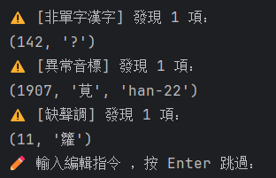

由於我之前是基於命令行交互的，所以更改文檔內容採用的是指令形式。之後如果做html前端的話，會採用更加直觀的方式。目前已有指令可以替換漢字、刪行、替換單個音標、批量替換音標。

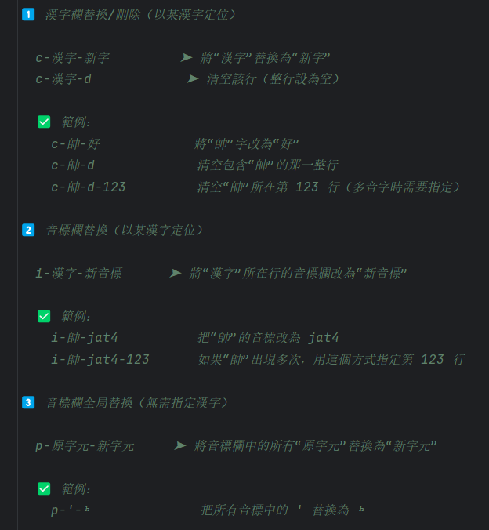

2. 分別按照入聲、舒聲整理所有的聲調，觀察是否有不符合的調值

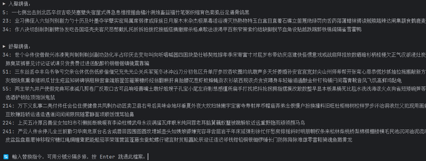

如果有需要替換的，可以通過r/s分別替換入聲、舒聲。

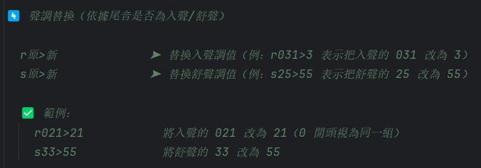

正確輸入指令後，會自動更改excel，進行替換。

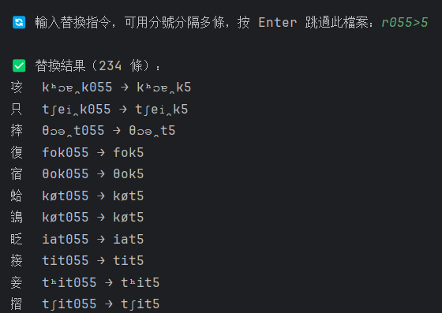

3. 處理零聲母。查詢是否有聲母為空、但是韻母以u/i/y開頭的音節。展示出來每一行，等待用戶處理

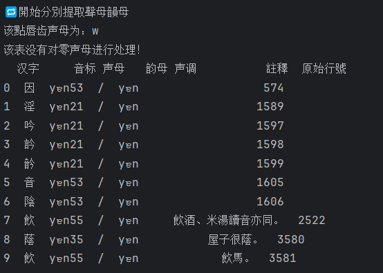

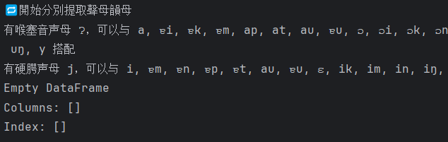

用戶可以輸入行號，選擇要替換的音標。

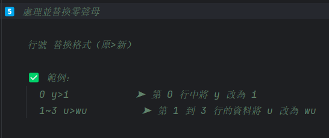

輸入指令，替換即刻生效

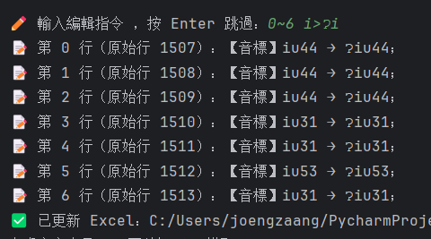

4. 整理並展示該點的所有聲母、韻母的類別以及數量，看是否有填錯/不該有的對立。

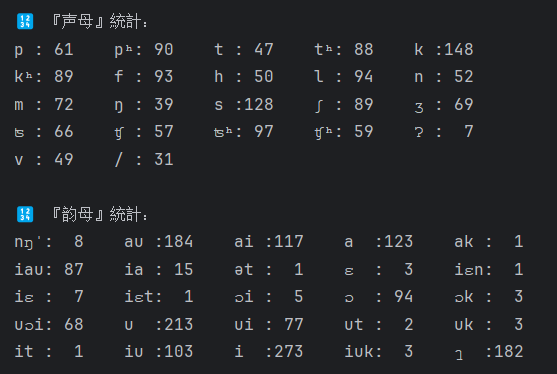

可以輸入一個或多個音標，匹配查詢，輸出該音位對應的所有行。然後也可以像處理零聲母一樣，輸入行號並選擇替換內容。

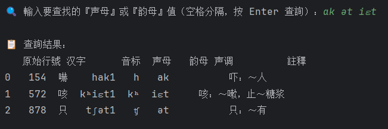

5. 展示訓讀、出韻情況。按照聲鈕、韻攝整理聲母、韻母，輸出所有出韻情況（只有一個字且占比小於8%，或占比小於3%）。

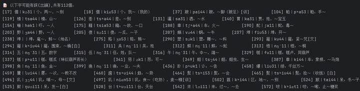

##### jyut - 粵拼轉 IPA

將粵拼音標批量轉換為 IPA 國際音標。

```bash
python utils.py -t jyut
```

基於自定規則表，將粵拼（jyutping）批量轉換為 IPA。

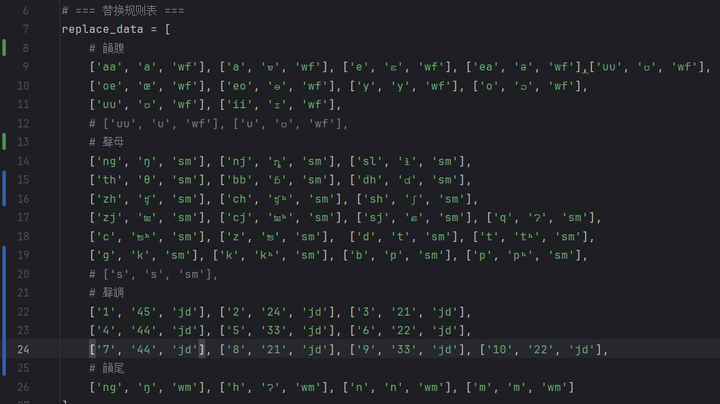

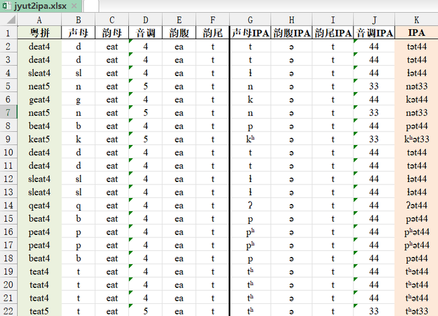

##### MERGE - 字表合併

合併多個字表文件。

```bash
python utils.py -t MERGE
```

**功能**：
- 接收一個或多個文件（一字一行格式）
- 按照參考表（主表）漢字順序合併
- 補充主表以外的漢字（來自補充表）
- 自動處理多音字（相同讀音保留一個，不同讀音用分號分隔）
- 將注釋添加到批注中

接收用戶輸入的一個或多個文件（一字一行格式），按照參考表裡（主表）漢字的順序進行合併，如果部分資料存在主表以外的漢字（這些漢字存在於補充表裡），會把這些字補充到最後。如果不需要補充多餘的字，把補充表留空即可。

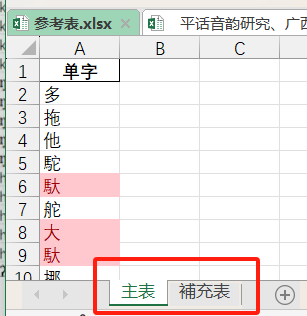

如果字表裡的一個字對應了多行，如果每行讀音相同，則輸出單元格只保留一個讀音，如果讀音不同則用分號;分隔。如果某行有注釋，注釋均會被添加到批注中。

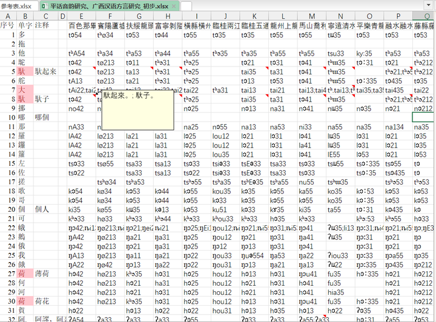

##### COMPARE - 文件差異比較

比較 `yindian` 和 `pull_yindian` 目錄的文件差異，用於檢查增量更新的內容。

```bash
python utils.py -t COMPARE
```

**功能**：
- 對比兩個目錄下的 TSV 文件
- 識別新增、修改、刪除的文件
- 生成詳細的差異報告
- 導出報告到 `data/yindian_comparison_report.txt`

**使用場景**：
- 在執行 `update` 參數前，先檢查有哪些變化
- 驗證外部數據源更新的內容
- 追蹤方言點數據的變更歷史

##### CLEANUP - 重複文件清理

清理 `yindian` 和 `processed` 目錄下的重複文件，避免數據冗餘。

```bash
python utils.py -t CLEANUP
```

**功能**：
- 掃描 `data/yindian/` 和 `data/processed/` 目錄
- 識別完全相同的重複文件（基於內容 hash）
- 列出重複文件列表供用戶確認
- 導出清理報告到 `data/cleanup_report.txt`

**注意**：
- 默認需要用戶手動確認才刪除（`auto_confirm=False`）
- 建議在清理前先備份數據
- 清理後需要重新運行 `sync` 以更新存儲標記

---

## 數據庫架構

### 1. dialects_query.db（方言點查詢庫）

> **數據庫文件名稱：**
> - Admin 模式：`query_admin.db`
> - User 模式：`query_user.db`
> - 概念名稱：`dialects_query.db`（指代以上兩個文件）

**表：dialects**

| 字段 | 類型 | 說明 | 範例 |
|------|------|------|------|
| 簡稱 | TEXT | 方言點簡稱 | 广州、天津 |
| 語言 | TEXT | 語言類型 | 粵語、吳語 |
| 音典排序 | INTEGER | 排序號 | 1, 2, 3 |
| 經緯度 | TEXT | GCJ-02 坐標 | 23.13,113.26 |
| 地圖集二分區 | TEXT | 地圖分區 | 粵語-珠江三角洲 |
| 音典分區 | TEXT | 音典分區 | 粵語-廣東-珠江 |
| 省 | TEXT | 省級行政區 | 廣東、浙江 |
| 市 | TEXT | 市級行政區 | 廣州、杭州 |
| 縣 | TEXT | 縣級行政區 | 番禺、蕭山 |
| 鎮 | TEXT | 鎮級行政區 | 石碁、臨浦 |
| 行政村 | TEXT | 行政村 | 石碁村 |
| 自然村 | TEXT | 自然村 | 東沙村 |
| T1陰平 | TEXT | 第一調（陰平） | 55, 33 等 |
| T2陽平 | TEXT | 第二調（陽平） | 21, 24 等 |
| T3陰上 | TEXT | 第三調（陰上） | 35, 52 等 |
| T4陽上 | TEXT | 第四調（陽上） | 11, 13 等 |
| T5陰去 | TEXT | 第五調（陰去） | 33, 55 等 |
| T6陽去 | TEXT | 第六調（陽去） | 22, 11 等 |
| T7陰入 | TEXT | 第七調（陰入） | 5, 3 等 |
| T8陽入 | TEXT | 第八調（陽入） | 2, 1 等 |
| T9其他調 | TEXT | 第九調（其他調類） | 214, 323 等 |
| T10輕聲 | TEXT | 第十調（輕聲） | 1, 0 等 |
| 字表來源（母本） | TEXT | 字表來源 | 漢字音典、自錄 |
| 方言島 | TEXT | 是否為方言島 | 1/NULL |
| 地圖級別 | TEXT | 地圖顯示級別 | 1/2/3 |
| 存儲標記 | INTEGER | 是否有數據 | 1/NULL |

**索引（8 個）**：
```sql
-- 基礎索引
CREATE UNIQUE INDEX idx_dialects_code ON dialects(簡稱);
CREATE INDEX idx_dialects_yindian_zone ON dialects(音典分區);
CREATE INDEX idx_dialects_atlas_zone ON dialects(地圖集二分區);
CREATE INDEX idx_dialects_flag ON dialects(存儲標記);

-- 復合索引
CREATE INDEX idx_dialects_code_flag ON dialects(簡稱, 存儲標記);

-- 存儲標記相關（性能優化）
CREATE INDEX idx_dialects_storage ON dialects(存儲標記, 簡稱);
CREATE INDEX idx_query_partition_storage ON dialects(音典分區, 存儲標記);
CREATE INDEX idx_query_atlas_storage ON dialects(地圖集二分區, 存儲標記);
```

---

### 2. dialects_all.db（字音數據庫）

> **數據庫文件名稱：**
> - Admin 模式：`dialects_admin.db`
> - User 模式：`dialects_user.db`
> - 概念名稱：`dialects_all.db`（指代以上兩個文件）
>
> **注意：** 這兩個數據庫文件較大（可能數 GB），實際使用時可能需要移動到其他路徑存儲。

**表：dialects**

| 字段 | 類型 | 說明 | 範例 |
|------|------|------|------|
| 簡稱 | TEXT | 方言點簡稱 | 广州 |
| 漢字 | TEXT | 漢字字形 | 時 |
| 音節 | TEXT | IPA 音節 | tɕi33 |
| 聲母 | TEXT | 聲母 | tɕ |
| 韻母 | TEXT | 韻母 | i |
| 聲調 | TEXT | 聲調名稱 | 陰平 |
| 註釋 | TEXT | 注釋信息 | 文讀;書面語 |
| 多音字 | TEXT | 多音字標記 | 1/NULL |

**索引（11 個，優化性能）**：
```sql
-- 單列索引
CREATE INDEX idx_dialects_abbr ON dialects(簡稱);
CREATE INDEX idx_dialects_char ON dialects(漢字);
CREATE INDEX idx_dialects_syllable ON dialects(音節);
CREATE INDEX idx_dialects_polyphonic ON dialects(多音字);

-- 復合索引（優化多字段查詢）
CREATE INDEX idx_dialects_char_abbr ON dialects(漢字, 簡稱);
CREATE INDEX idx_dialects_abbr_char ON dialects(簡稱, 漢字);
CREATE INDEX idx_dialects_abbr_char_syllable ON dialects(簡稱, 漢字, 音節);

-- 音韻檢索索引（聲韻調查詢優化）
CREATE INDEX idx_dialects_abbr_initial ON dialects(簡稱, 聲母);
CREATE INDEX idx_dialects_abbr_final ON dialects(簡稱, 韻母);
CREATE INDEX idx_dialects_abbr_tone ON dialects(簡稱, 聲調);

-- 多音字復合索引
CREATE INDEX idx_dialects_polyphonic_full ON dialects(多音字, 簡稱, 漢字);
```

**查詢範例**：
```sql
-- 查詢"時"字在廣州的讀音
SELECT * FROM dialects WHERE 漢字='時' AND 簡稱='广州';

-- 查詢廣州的所有多音字
SELECT DISTINCT 漢字 FROM dialects WHERE 簡稱='广州' AND 多音字='1';

-- 統計各方言點的字數
SELECT 簡稱, COUNT(DISTINCT 漢字) as 字數 FROM dialects GROUP BY 簡稱;
```

---

### 3. characters.db（中古音地位庫）

**表：characters**

| 字段 | 類型 | 說明 | 範例 |
|------|------|------|------|
| 攝 | TEXT | 中古攝 | 假、咸、宕 |
| 呼 | TEXT | 四呼 | 開、合 |
| 等 | TEXT | 等級 | 一、二、三、四 |
| 韻 | TEXT | 韻部 | 之、仙、佳、侯 |
| 入 | TEXT | 入聲標記 | 入、舒 |
| 調 | TEXT | 四聲 | 平、上、去、入 |
| 清濁 | TEXT | 清濁性 | 全清、全濁、次清、次濁 |
| 系 | TEXT | 聲母系 | 幫、知、端、見、影 |
| 組 | TEXT | 聲母組 | 幫、端、精、章、影 |
| 母 | TEXT | 中古聲母 | 並、云、以、來 |
| 部位 | TEXT | 發音部位 | 雙唇、齒、舌尖、舌面 |
| 方式 | TEXT | 發音方式 | 塞、擦、塞擦、鼻、邊 |
| 漢字 | TEXT | 漢字 | 時 |
| 釋義 | TEXT | 釋義 | 四時也 |
| 多地位標記 | TEXT | 多地位標記 | 1/NULL |
| 多聲母 | TEXT | 多聲母標記 | 1/NULL |
| 多等 | TEXT | 多等標記 | 1/NULL |
| 多韻 | TEXT | 多韻標記 | 1/NULL |
| 多調 | TEXT | 多調標記 | 1/NULL |

**字段總數**：18 個（基礎字段 14 個 + 變異標記字段 5 個）

**索引（20+ 個）**：
```sql
-- 單列索引（18 個，每個字段一個）
CREATE INDEX idx_characters_漢字 ON characters(漢字);
CREATE INDEX idx_characters_攝 ON characters(攝);
CREATE INDEX idx_characters_呼 ON characters(呼);
CREATE INDEX idx_characters_等 ON characters(等);
CREATE INDEX idx_characters_韻 ON characters(韻);
CREATE INDEX idx_characters_入 ON characters(入);
CREATE INDEX idx_characters_調 ON characters(調);
CREATE INDEX idx_characters_清濁 ON characters(清濁);
CREATE INDEX idx_characters_系 ON characters(系);
CREATE INDEX idx_characters_組 ON characters(組);
CREATE INDEX idx_characters_母 ON characters(母);
CREATE INDEX idx_characters_部位 ON characters(部位);
CREATE INDEX idx_characters_方式 ON characters(方式);
CREATE INDEX idx_characters_多地位標記 ON characters(多地位標記);
CREATE INDEX idx_characters_多聲母 ON characters(多聲母);
CREATE INDEX idx_characters_多等 ON characters(多等);
CREATE INDEX idx_characters_多韻 ON characters(多韻);
CREATE INDEX idx_characters_多調 ON characters(多調);

-- 復合索引（性能優化，用於組合查詢）
CREATE INDEX idx_characters_攝等漢字 ON characters(攝, 等, 漢字);
CREATE INDEX idx_characters_攝呼漢字 ON characters(攝, 呼, 漢字);
CREATE INDEX idx_characters_組母攝韻調 ON characters(組, 母, 攝, 韻, 調);
CREATE INDEX idx_characters_母韻調 ON characters(母, 韻, 調);
-- ... 以及其他優化組合查詢的復合索引
```

**變異標記字段說明**：
- **多聲母**：標記該字在中古音是否有多個聲母讀法
- **多等**：標記該字是否橫跨多個等第
- **多韻**：標記該字是否有多個韻部歸屬
- **多調**：標記該字是否有多個聲調變體
- **多地位標記**：總標記（任一變異存在則為 1）

---

## 配置文件

### 數據庫配置（common/config.py）

項目會根據用戶模式（admin/user）生成不同的數據庫文件：

**Admin 模式數據庫：**
- `DIALECTS_DB_ADMIN_PATH` = `data/dialects_admin.db`（音韻數據庫）
- `QUERY_DB_ADMIN_PATH` = `data/query_admin.db`（查詢元數據庫）

**User 模式數據庫：**
- `DIALECTS_DB_USER_PATH` = `data/dialects_user.db`（音韻數據庫）
- `QUERY_DB_USER_PATH` = `data/query_user.db`（查詢元數據庫）

**共用數據庫：**
- `CHARACTERS_DB_PATH` = `data/characters.db`（中古音地位庫）

**向後兼容性：**
代碼中保留了舊的常量名 `DIALECTS_DB_PATH` 和 `QUERY_DB_PATH`，它們默認指向 admin 模式的數據庫。

**注意：**
- `dialects_admin.db` 和 `dialects_user.db` 文件可能非常大（數 GB）
- 如需節省磁盤空間，可以在生成後移動到其他存儲位置
- `query_*.db` 文件通常較小（1-2 MB）

---

### 核心配置：jengzang補充.xlsx

**位置**：`data/dependency/jengzang補充.xlsx`

**Sheet：檔案**

### 依賴數據文件說明

項目依賴多個音韻學數據文件，位於 `data/dependency/` 目錄：

#### 必需文件

| 文件名 | 用途 | 說明 |
|--------|------|------|
| `jengzang補充.xlsx` | 核心配置 | 定義所有方言點的元數據、文件映射、處理參數 |
| `聲韻.xlsx` | 中古音地位 | 用於生成 `characters.db`，包含每個漢字的攝、呼、等、韻等信息 |

#### 可選文件（用於特定功能）

| 文件名 | 用途 | 說明 |
|--------|------|------|
| `正字.tsv` | 簡繁轉換 | 自定義正字表，優先於 OpenCC |
| `上古漢語.xlsx` | 上古音處理 | 上古漢語音韻數據 |
| `上古汉语音节表.xlsx` | 上古音節 | 上古音節系統 |
| `王三全字表（小韻內部未校）+3.3.xlsx` | 王力音韻 | 王力《漢語音韻》數據 |
| `王三反切音韻地位表.csv` | 反切系統 | 反切音韻地位對照表 |
| `中原音韻.tsv` | 近代音韻 | 中原音韻數據（元代） |
| `洪武正韻.xlsx` | 近代音韻 | 洪武正韻數據（明代） |
| `分韻撮要.xlsx` | 粵語音韻 | 粵語韻書數據 |
| `蒙古字韻.tsv` | 元代音韻 | 蒙古字韻數據 |

**注意**：
- 只有 `jengzang補充.xlsx` 和 `聲韻.xlsx` 是運行 `build.py` 的必需文件
- 其他文件用於 `scripts/export/process_ancient_pinyin.py` 等特定工具
- 如果缺少可選文件，相關功能會被跳過，不影響主流程

---

## 填表說明

如果需要轉換自己的字表，需要先填寫 data/dependency/信息.xlsx

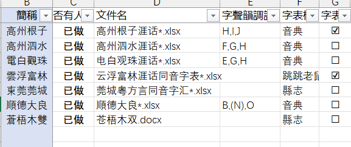

### 必填字段說明：

| 字段 | 必填 | 說明 | 範例 |
|------|------|------|------|
| **簡稱** | ✅ | 方言點簡稱（唯一標識） | 广州、香港、台北 |
| **文件名** | ✅ | 原始文件名（支持 * 通配符） | 广州*.xlsx |
| **字表格式** | ✅ | 格式類型 | 音典 / 跳跳老鼠 / 縣志 |
| **繁簡** | ⭕ | 簡繁標記 | 简（需轉繁）/ 繁 / 其他 |
| **字聲韻調註列名** | ⭕ | 音典格式列號 | A,B,C 或 A,(G),H |
| **字表使用調值** | ⭕ | 是否使用調值 | ☑（使用）/ ☐（不使用） |
| **拼音** | ⭕ | 拼音系統 | 粵拼 / 其他 |
| **是否有人在做** | ✅ | 處理開關 | 已做 / 否 |
| **待更新** | ⭕ | 追加模式標記 | 1（需更新）/ 0（跳過） |

**要點說明**：

1. **程序只會處理標注為"已做"的字表**
2. **文件名支持 * 模糊匹配**（如 `广州*.xlsx`）
3. **字表格式**必須為以下之一：
   - **音典**（.xls .xlsx）：一字一音
   - **跳跳老鼠**（.xls .xlsx）：一個音節對應多個字
   - **縣志**（.xls .xlsx .doc .docx）：聲、韻均拆開整理
4. **是否使用調值**：
   - ☑：字表填的是調值（如 33, 42）
   - ☐：字表填的是調類（如 陰平、陽去）

這些字表格式，是來源於漢字音典的標準。音典的處理代碼也開源了，但我沒太看懂，就自己寫了一份。

具體可以參考 data/raw 路徑下的格式。

**字聲韻調註列名格式說明**（僅音典格式需要）：

對於音典格式，需要填入列號。第一列是"字"，第二列是"音"，第三列是"注釋"。如果第二列用"（）()"括住，則代表使用粵拼。

```
# 格式：列號用逗號分隔
A,B,C          # 表示 A=漢字, B=音標, C=註釋

# 粵拼識別：用括號包裹
A,(G),H        # 表示 A=漢字, G=粵拼, H=註釋
```

如果你的Excel列名能與這些對應，則可以不填列號：

```
col_map = {
    '漢字': ['漢字_程序改名', '單字', '#漢字', '单字', '漢字', 'phrase', '汉字'],
    '音標': ['IPA_程序改名', 'IPA', 'ipa', '音標', 'syllable'],
    '解釋': ['注釋_程序改名', '注释', '注釋', '解釋', 'notes']
}
```

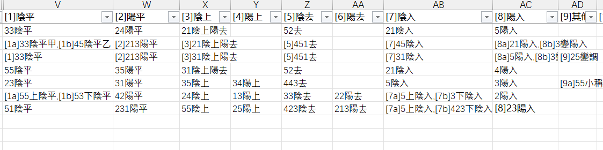

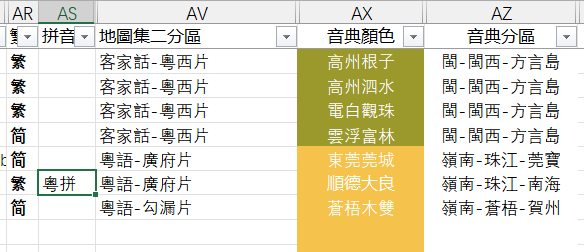

---

## 數據處理流程

### 完整流程圖

```
原始字表 / MCPDict 音典資料
    ↓
格式轉換 / TSV 導出
    ↓
聲調處理與音韻數據提取
    ↓
數據庫寫入
    ↓
查詢庫構建與存儲標記同步
    ↓
字表變動、聲調欄、文件名匹配檢查
    ↓
完成
```

### 性能優化

| 階段 | 優化措施 | 效果 |
|------|---------|------|
| 數據插入 | executemany() 批量插入 | 10-50x |
| 數據庫寫入 | PRAGMA synchronous=OFF | 2-5x |
| 查詢優化 | 復合索引 (漢字,簡稱) | 50-200x |

**總體性能**：處理 2000 個方言點，600 萬條數據，從 ~120 分鐘優化到 ~15-20 分鐘，**提速 6-8 倍**。

---

## 常見問題

### 安裝與環境

#### Q: 安裝依賴時報錯 "No module named 'xxx'"

**解決**：
```bash
# 確認 Python 版本
python --version  # 需要 3.8+

# 重新安裝依賴
pip install -r requirements.txt --upgrade

# 如果使用虛擬環境，確保已激活
source .venv/bin/activate  # Linux/Mac
.venv\Scripts\activate     # Windows
```

#### Q: 如何驗證安裝是否成功？

**解決**：
```bash
# 測試依賴
python -c "import pandas, openpyxl, opencc; print('✓ 依賴正常')"

# 測試主程序
python build.py --help
```

### 配置與數據

#### Q: 錯誤："找不到對應處理函數"

**原因**：配置文件中的"字表格式"填寫錯誤

**解決**：檢查 `data/dependency/jengzang補充.xlsx` 中的"字表格式"列，必須是以下之一：
- `音典`
- `跳跳老鼠`
- `縣志`

#### Q: 錯誤："無法匹配任何文件"

**原因**：找不到對應的字表文件

**解決**：
1. 確認文件在 `data/raw/` 目錄下
2. 檢查配置中的"文件名"是否正確
3. 支持通配符：`广州*.xlsx` 可以匹配 `广州.xlsx`、`广州方言.xlsx` 等

#### Q: 粵拼轉換失敗

**解決**：
1. 確認配置中"拼音"列填寫為 `粵拼`
2. "字聲韻調註列名"用括號標記粵拼列：`A,(G),H`（G列是粵拼）

#### Q: 缺少必需的依賴文件

**錯誤信息**：`FileNotFoundError: data/dependency/jengzang補充.xlsx`

**解決**：
- 確保 `data/dependency/` 目錄包含以下必需文件：
  - `jengzang補充.xlsx`（核心配置）
  - `聲韻.xlsx`（中古音地位表）

### 運行與處理

#### Q: 程序運行很慢，如何加速？

**建議**：
1. 使用 SSD 硬盤存儲數據庫
2. 關閉殺毒軟件的實時掃描
3. 增加系統內存（推薦 8GB+）
4. 分批處理：先處理部分方言點測試

#### Q: 數據庫文件太大，磁盤空間不足

**解決**：
```bash
# 查看數據庫大小
ls -lh data/*.db

# 移動大文件到其他磁盤
mv data/dialects_admin.db /path/to/large/disk/

# 更新代碼中的路徑（修改 common/config.py）
```

#### Q: update 模式沒有效果

**解決**：
1. 確認 `data/raw/pull_yindian/` 目錄存在且包含 TSV 文件
2. 檢查文件名是否與配置中的"簡稱"匹配
3. 運行後需要同步：`python build.py -u admin -t update sync`

#### Q: 如何查看處理日誌？

**解決**：
```bash
# 查看日誌文件
cat logs/write.txt          # 寫入日誌
cat logs/write_error.txt    # 錯誤日誌
cat logs/缺資料.txt         # 缺失數據警告
```

### 數據驗證

#### Q: 如何驗證數據是否正確寫入？

**解決**：
```bash
# 使用 SQLite 命令行
sqlite3 data/dialects_admin.db

# 查詢示例
SELECT COUNT(*) FROM dialects;                    -- 總記錄數
SELECT DISTINCT 簡稱 FROM dialects;               -- 所有方言點
SELECT * FROM dialects WHERE 漢字='時' LIMIT 10;  -- 查詢特定字
```

#### Q: COMPARE 和 CLEANUP 的使用時機

**建議**：
- **COMPARE**：在執行 `update` 前，先查看有哪些文件變化
  ```bash
  python utils.py -t COMPARE
  cat data/yindian_comparison_report.txt
  ```
- **CLEANUP**：定期清理（例如每季度一次），避免重複數據堆積
  ```bash
  python utils.py -t CLEANUP
  cat data/cleanup_report.txt
  ```

### 進階問題

#### Q: 如何添加自定義的字表格式？

**解決**：修改 `source/format_convert.py`，添加新的處理函數：
```python
def process_自定義格式(file_path, ...):
    # 你的處理邏輯
    return df  # 返回標準格式 DataFrame
```

#### Q: 如何導出數據為 Excel？

**解決**：
```bash
# 使用導出工具
python -c "from scripts.export.fanwan_sql_to_xlsx import export; export()"
```

#### Q: 遇到其他問題怎麼辦？

**建議**：
1. 查看 [CLAUDE.md](CLAUDE.md) 獲取更詳細的技術文檔
2. 在 [GitHub Issues](https://github.com/jengzang/chars/issues) 提問
3. 提供錯誤信息和日誌文件以便診斷

---

## 許可證

MIT License

Copyright (c) 2024 方音圖鑒項目

---

## 致謝

感謝所有為漢字方言研究做出貢獻的學者和開發者。

特別感謝：
- **漢字音典**項目團隊
- **OpenCC** 簡繁轉換工具
- **Pandas** 數據處理庫

---

**⭐ 如果這個項目對你有幫助，請給我們一個 Star！**
