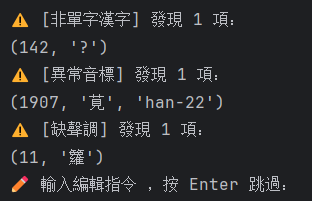

---
不羁的方言比较——地理语言学小站
---

# 📘 字表预处理工具

## 安装依赖

```bash
pip install -r requirements.txt
```

### **build.py**

该工具用于 **字表的预处理**，包括：

1.excel/word各类格式的字表转tsv

2.提取转好的tsv数据每个字、音对应的声母、韵母、声调，写入数据库

3.最后生成三个数据库：

- characters.db:存每个汉字的中古地位
- ···["攝", "呼", "等", "韻", "入", "調", "清濁", "系", "組", "母", "漢字", "多地位標記"]
- dialects_all.db:存每个方言点声韵调信息
- ···["簡稱", "漢字", "音節", "聲母", "韻母", "聲調", "注釋", "多音字"]
- dialects_query.db:记录每个地点的经纬度、行政区划、调值、分区等信息
- ···很多列，不具体说了

---

## 🔧 使用方法

```bash
python build.py [选项]
```

## 🔧 使用方法

```bash
python build.py [选项]
```

## 参数说明

**-u 或 --user**  
指定写入的数据库类型。可以是 admin 或 user。默认是 admin。  
具体区别是，user只写入yindian文件夹下的数据，用于我的网站区分普通用户和管理员数据库。
如果是自用，默认admin即可。

**-t 或 --type**  
选择要执行的功能，可以同时写多个。可选值：  
convert    → 转换字表为 TSV  
query      → 写入方言查询数据库  
sync       → 同步方言存储标记  
chars      → 写入中古地位表  
append     → 以追加模式写入数据库  
needchars  → 写入的同时，更新中古音数据库  

不给参数，则默认把processed里面的tsv写入数据库。

---

## 填表说明

如果需要转换自己的字表，需要先填写data/dependency/信息.xlsx


1.程序只会处理标注为“已做”的字表；

2.文件用*可模糊匹配；

3.字表格式

- 音典(.xls .xlsx)--一字一音；
- 跳跳老鼠(.xls .xlsx)--一个音节对应多个字；
- 县志(.xls .xlsx .doc .docx)--声、韵均拆开整理。

- 具体可以参考data/raw路径下的格式。

- 这些字表格式，是来源于汉字音典的标准。音典的处理代码也开源了，但我没太看懂，就自己写了一份。

- 对于音典格式，需要填入列号。第一列是“字”，第二列是“音”，第三列是“注释”。如果第二列用“（）()“括住，则代表使用粤拼。

- 如果你的Excel列名能与这些对应，则可以不填列号：

  ```
  col_map = {
      '漢字': ['漢字_程序改名', '單字', '#漢字', '单字', '漢字', 'phrase', '汉字'],
      '音標': ['IPA_程序改名', 'IPA', 'ipa', '音標', 'syllable'],
      '解釋': ['注釋_程序改名', '注释', '注釋', '解釋', 'notes']
  }
  ```

4.是否使用调值：如果字表里填的调值--请打勾；如果填的是调类，不用打勾


---

# 字表处理脚本

此脚本用于运行 `scripts` 路径下的不同程序，包括：
- 检查字表格式和错字
- 粤拼转 IPA
- 合并字表

## 使用方法

```
python run_scripts.py [选项]
```

## 参数说明

**-t 或 --type**  
选择要执行的功能。必须指定一个。可选值：  
CHECK    → 检查字表格式和错字  
jyut     → 粤拼转 IPA  
MERGE    → 合并字表  

## 使用示例

#### 检查字表格式和错字

```
python  utils.py -t CHECK  
```

1. 支持输入各种格式：一字一行（音典格式）、音节-对应字（跳跳老鼠格式）、#韵-声母-声调（县志格式）；*.xlsx *.xls *.doc *.docx *.tsv等格式。会把所有字表自动转换成音典格式，并进行校对。

   会进行五重校对：

   1.是否有不合规范的汉字字符；是否有缺声调的情况；音标内是否有不被允许的字符

   

   由于我之前是基于命令行交互的，所以更改文档内容采用的是指令形式。之后如果做html前端的话，会采用更加直观的方式。目前已有指令可以替换汉字、删行、替换单个音标、批量替换音标。

   

   2.分别按照入声、舒声整理所有的声调，观察是否有不符合的调值

   

   如果有需要替换的，可以通过r/s分别替换入声、舒声。

   

   正确输入指令后，会自动更改excel，进行替换。

   

   

   3.处理零声母。查询是否有声母为空、但是韵母以u/i/y开头的音节。展示出来每一行，等待用户处理

   

   

   

   

   用户可以输入行号，选择要替换的音标。

   

   输入指令，替换即刻生效

   

   4.整理并展示该点的所有声母、韵母的类别以及数量，看是否有填错/不该有的对立。

   

   可以输入一个或多个音标，匹配查询，输出该音位对应的所有行。然后也可以像处理零声母一样，输入行号并选择替换内容。

   

   5.展示训读、出韵情况。按照声钮、韵摄整理声母、韵母，输出所有出韵情况（只有一个字且占比小于8%，或占比小于3%）。

   

####  粤拼转 IPA

```
python  utils.py -t jyut  
```

基于自定规则表，将粤拼（j++）批量转换为IPA。


#### 合并字表  

```
python utils.py -t MERGE  
```

接收用户输入的一个或多个文件（一字一行格式），按照参考表里（主表）汉字的顺序进行合并，如果部分资料存在主表以外的汉字（这些汉字存在于补充表里），会把这些字补充到最后。如果不需要补充多余的字，把补充表留空即可。


如果字表里的一个字对应了多行，如果每行读音相同，则输出单元格只保留一个读音，如果读音不同则用分号;分隔。如果某行有注释，注释均会被添加到批注中。


###  


##  