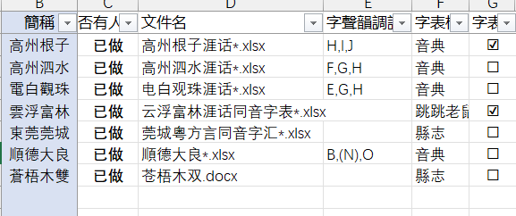
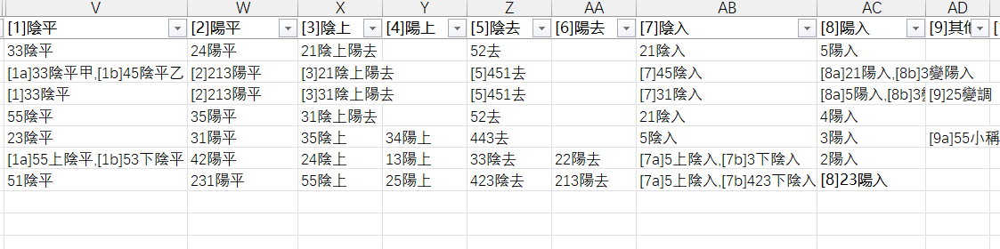
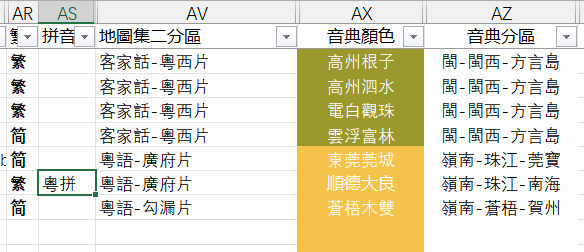

---
# 不羁的方言比较——地理语言学小站
---

**[方音圖鑒](https://dialects.yzup.top/)**
访问「方音圖鑒」首页：[🔗 dialects.yzup.top](https://dialects.yzup.top/)

[](https://www.python.org)
[](LICENSE)

> 漢字方言音典數據預處理系統，支持多種字表格式轉換、音韻數據提取與 SQLite 數據庫構建

---

## 📚 目錄

- [項目簡介](#項目簡介)
- [相關倉庫](#相關倉庫)
- [核心功能](#核心功能)
- [快速開始](#快速開始)
- [安裝指南](#安裝指南)
- [使用說明](#使用說明)
  - [主腳本：build.py](#主腳本buildpy)
  - [輔助腳本：utils.py](#輔助腳本utilspy)
- [數據庫架構](#數據庫架構)
- [配置文件](#配置文件)
- [數據處理流程](#數據處理流程)
- [常見問題](#常見問題)
- [性能優化](#性能優化)
- [許可證](#許可證)
- [致謝](#致謝)

---

## 項目簡介

**方音圖鑒字表預處理工具**是一個用於處理漢字方言音典數據的工業級 ETL 系統。它可以：

- 📄 **支持多種格式**：Excel (.xlsx/.xls)、Word (.docx)、TSV/CSV 等
- 🎵 **提取音韻信息**：自動識別聲母、韻母、聲調，支持 IPA 和粵拼
- 🗄️ **構建數據庫**：生成優化的 SQLite 數據庫，支持百萬級數據查詢
- 🌏 **地理坐標**：自動轉換百度坐標到 GCJ-02（火星坐標系）
- 🔤 **簡繁轉換**：基於正字表和 OpenCC 的多層級轉換
- ⚡ **高性能處理**：批量插入、內存日志、復合索引優化

### 數據庫結構

生成三個核心數據庫：

1. **characters.db**：存儲每個漢字的中古地位
   - 欄位：["攝", "呼", "等", "韻", "入", "調", "清濁", "系", "組", "母", "漢字", "多地位標記"]

2. **dialects_all.db**：存儲每個方言點的聲韻調信息
   - 欄位：["簡稱", "漢字", "音節", "聲母", "韻母", "聲調", "註釋", "多音字"]

3. **dialects_query.db**：記錄每個地點的經緯度、行政區劃、調值、分區等信息
   - 包含地理信息、聲調系統（T1~T10）、行政區劃等多個欄位

### 性能指標

- 處理速度：2000 個方言點，600 萬條數據
- **優化前**：~120 分鐘
- **優化後**：~15-20 分鐘
- **提速**：6-8 倍

---

## 相關倉庫

### 相關倉庫一覽

- **[後端 - Dialects Backend](https://github.com/jengzang/dialects-backend)**
  [](https://github.com/jengzang/dialects-backend)

- **[前端 - Dialects JS Frontend](https://github.com/jengzang/dialects-js-frontend)**
  [](https://github.com/jengzang/dialects-js-frontend)

---

## 核心功能

### 1. 字表格式轉換

支持三種主流字表格式：

| 格式 | 說明 | 範例 |
|------|------|------|
| **音典** | 一字一音，標準音典格式 | `#漢字 音標 解釋` |
| **跳跳老鼠** | 一音多字，按音節分組 | `音節 漢字列表` |
| **縣志** | 分拆表格，按聲韻調分類 | `#韻 聲母 聲調 字` |

### 2. 音韻數據提取

- ✅ 自動識別聲母、韻母、聲調
- ✅ 支持 IPA 國際音標
- ✅ 支持粵拼 (Jyutping) 轉換
- ✅ 多音字自動標記
- ✅ 文白讀音註釋合併

### 3. 數據處理管道

```
原始字表 → 格式識別 → TSV轉換 → 聲調處理 → 數據提取 → 數據庫寫入 → 索引優化
```

---

## 快速開始

### 前置需求

- Python 3.8+
- SQLite 3.x

### 最小化範例

```bash
# 1. 克隆項目
git clone https://github.com/jengzang/chars.git
cd chars

# 2. 安裝依賴
pip install -r requirements.txt

# 3. 準備數據
# 將字表文件放入 data/raw/ 目錄

# 4. 配置元表
# 在 data/dependency/jengzang補充.xlsx 中填寫字表信息

# 5. 執行預處理
python build.py -u admin -t convert needchars sync chars

# 6. 查看生成的數據庫
# data/dialects_all.db, data/dialects_query.db, data/characters.db
```

---

## 安裝指南

### 安裝依賴

```bash
pip install -r requirements.txt
```

### 方式一：使用 pip

```bash
# 創建虛擬環境（推薦）
python -m venv .venv
source .venv/bin/activate  # Windows: .venv\Scripts\activate

# 安裝依賴
pip install -r requirements.txt
```

### 方式二：手動安裝

```bash
pip install pandas==2.2.3
pip install openpyxl==3.1.5
pip install xlrd==2.0.1
pip install python-docx==1.1.2
pip install opencc==1.1.9
```

### 依賴說明

| 套件 | 版本 | 用途 |
|------|------|------|
| pandas | 2.2.3 | 數據處理與 DataFrame 操作 |
| openpyxl | 3.1.5 | Excel 2007+ 格式讀寫 |
| xlrd | 2.0.1 | 舊版 Excel 支持 |
| python-docx | 1.1.2 | Word 文檔處理 |
| opencc | 1.1.9 | 簡繁體轉換 |

---

## 使用說明

### 主腳本：build.py

該工具用於 **字表的預處理**，包括：

1. excel/word各類格式的字表轉tsv
2. 提取轉好的tsv數據每個字、音對應的聲母、韻母、聲調，寫入數據庫
3. 最後生成三個數據庫：
   - characters.db: 存每個漢字的中古地位
   - dialects_all.db: 存每個方言點聲韻調信息
   - dialects_query.db: 記錄每個地點的經緯度、行政區劃、調值、分區等信息

#### 🔧 使用方法

```bash
python build.py [選項]
```

#### 參數說明

##### `-u, --user`：用戶類型

指定寫入的數據庫類型。可以是 admin 或 user。默認是 admin。

| 值 | 說明 | 包含數據 |
|----|------|---------| `admin` | 管理員模式（預設） | `data/processed/` + `data/yindian/` |
| `user` | 普通用戶模式 | 僅 `data/yindian/` |

具體區別是，user只寫入yindian文件夾下的數據，用於我的網站區分普通用戶和管理員數據庫。如果是自用，默認admin即可。

##### `-t, --type`：處理類型（可多選）

選擇要執行的功能，可以同時寫多個。可選值：

| 值 | 功能 | 說明 |
|----|------|------|
| `convert` | 字表轉 TSV | 將原始字表轉換為標準 TSV 格式 |
| `needchars` | 寫入中古音庫 | 同時寫入 dialects_all.db |
| `query` | 建立查詢庫 | 生成 dialects_query.db |
| `sync` | 同步存儲標記 | 在查詢庫中標記已存儲的方言點 |
| `chars` | 寫入中古地位表 | 從 聲韻.xlsx 生成 characters.db |
| `append` | 追加模式 | 只更新配置中標記為"待更新"的項 |

**注意**：不給參數，則默認把 processed 裡面的 tsv 寫入數據庫。

#### 常用命令範例

```bash
# 【完整預處理】轉換+寫入所有數據庫
python build.py

# 【僅轉換】將所有原始字表轉為 TSV
python build.py -u admin -t convert

# 【建立數據庫】將 TSV 寫入數據庫（不包含中古音庫）
python build.py -u admin

# 【完整管理員模式】全流程處理
python build.py -u admin -t convert needchars sync query chars

# 【普通用戶模式】僅處理 yindian 目錄數據
python build.py -u user

# 【增量更新】只更新特定方言點
python build.py -u admin -t convert needchars append sync

# 【僅更新查詢庫】重建方言點元數據
python build.py -u admin -t query sync
```

---

### 輔助腳本：utils.py

# 📘 字表處理腳本

此腳本用於運行 `scripts` 路徑下的不同程序，包括：
- 檢查字表格式和錯字
- 粵拼轉 IPA
- 合併字表

`utils.py` 提供數據檢查、格式轉換等輔助功能。

#### 使用方法

```bash
python utils.py -t [CHECK|jyut|MERGE]
```

#### 功能說明

##### CHECK - 五重字表校對

執行交互式字表檢查，包括：

1. **基礎校驗**：漢字字符合規性、缺聲調檢測、音標字符檢查
2. **聲調整理**：按入聲/舒聲整理聲調一致性
3. **零聲母處理**：u/i/y 開頭無聲母的情況
4. **音韻對立**：聲母、韻母對立關系檢查
5. **特殊標記**：訓讀、出韻情況展示

```bash
python utils.py -t CHECK
```

**交互式處理**：
- 支持輸入各種格式（音典、跳跳老鼠、縣志）
- 自動轉換為音典格式並校對
- 提供指令替換漢字、刪行、替換音標等

支持輸入各種格式：一字一行（音典格式）、音節-對應字（跳跳老鼠格式）、#韻-聲母-聲調（縣志格式）；*.xlsx *.xls *.doc *.docx *.tsv等格式。會把所有字表自動轉換成音典格式，並進行校對。

會進行五重校對：

1. 是否有不合規範的漢字字符；是否有缺聲調的情況；音標內是否有不被允許的字符


由於我之前是基於命令行交互的，所以更改文檔內容採用的是指令形式。之後如果做html前端的話，會採用更加直觀的方式。目前已有指令可以替換漢字、刪行、替換單個音標、批量替換音標。


2. 分別按照入聲、舒聲整理所有的聲調，觀察是否有不符合的調值


如果有需要替換的，可以通過r/s分別替換入聲、舒聲。


正確輸入指令後，會自動更改excel，進行替換。


3. 處理零聲母。查詢是否有聲母為空、但是韻母以u/i/y開頭的音節。展示出來每一行，等待用戶處理


用戶可以輸入行號，選擇要替換的音標。


輸入指令，替換即刻生效


4. 整理並展示該點的所有聲母、韻母的類別以及數量，看是否有填錯/不該有的對立。


可以輸入一個或多個音標，匹配查詢，輸出該音位對應的所有行。然後也可以像處理零聲母一樣，輸入行號並選擇替換內容。


5. 展示訓讀、出韻情況。按照聲鈕、韻攝整理聲母、韻母，輸出所有出韻情況（只有一個字且占比小於8%，或占比小於3%）。


##### jyut - 粵拼轉 IPA

將粵拼音標批量轉換為 IPA 國際音標。

```bash
python utils.py -t jyut
```

基於自定規則表，將粵拼（jyutping）批量轉換為 IPA。


##### MERGE - 字表合併

合併多個字表文件。

```bash
python utils.py -t MERGE
```

**功能**：
- 接收一個或多個文件（一字一行格式）
- 按照參考表（主表）漢字順序合併
- 補充主表以外的漢字（來自補充表）
- 自動處理多音字（相同讀音保留一個，不同讀音用分號分隔）
- 將注釋添加到批注中

接收用戶輸入的一個或多個文件（一字一行格式），按照參考表裡（主表）漢字的順序進行合併，如果部分資料存在主表以外的漢字（這些漢字存在於補充表裡），會把這些字補充到最後。如果不需要補充多餘的字，把補充表留空即可。


如果字表裡的一個字對應了多行，如果每行讀音相同，則輸出單元格只保留一個讀音，如果讀音不同則用分號;分隔。如果某行有注釋，注釋均會被添加到批注中。


---

## 數據庫架構

### 1. dialects_query.db（方言點查詢庫）

**表：dialects**

| 字段 | 類型 | 說明 | 範例 |
|------|------|------|------|
| 簡稱 | TEXT | 方言點簡稱 | 广州、天津 |
| 語言 | TEXT | 語言類型 | 粵語、吳語 |
| 音典排序 | INTEGER | 排序號 | 1, 2, 3 |
| 經緯度 | TEXT | GCJ-02 坐標 | 23.13,113.26 |
| 地圖集二分區 | TEXT | 地圖分區 | 粵語-珠江三角洲 |
| 音典分區 | TEXT | 音典分區 | 粵語-廣東-珠江 |
| T1陰平 ~ T10輕聲 | TEXT | 十種聲調值 | 454, 33, 42 等 |
| 存儲標記 | INTEGER | 是否有數據 | 1/NULL |

**索引**：
```sql
CREATE UNIQUE INDEX idx_dialects_code ON dialects(簡稱);
CREATE INDEX idx_dialects_yindian_zone ON dialects(音典分區);
CREATE INDEX idx_dialects_atlas_zone ON dialects(地圖集二分區);
CREATE INDEX idx_dialects_flag ON dialects(存儲標記);
CREATE INDEX idx_dialects_code_flag ON dialects(簡稱, 存儲標記);
```

---

### 2. dialects_all.db（字音數據庫）

**表：dialects**

| 字段 | 類型 | 說明 | 範例 |
|------|------|------|------|
| 簡稱 | TEXT | 方言點簡稱 | 广州 |
| 漢字 | TEXT | 漢字字形 | 時 |
| 音節 | TEXT | IPA 音節 | tɕi33 |
| 聲母 | TEXT | 聲母 | tɕ |
| 韻母 | TEXT | 韻母 | i |
| 聲調 | TEXT | 聲調名稱 | 陰平 |
| 註釋 | TEXT | 注釋信息 | 文讀;書面語 |
| 多音字 | TEXT | 多音字標記 | 1/NULL |

**索引（優化性能）**：
```sql
-- 單列索引
CREATE INDEX idx_dialects_abbr ON dialects(簡稱);
CREATE INDEX idx_dialects_char ON dialects(漢字);
CREATE INDEX idx_dialects_syllable ON dialects(音節);
CREATE INDEX idx_dialects_polyphonic ON dialects(多音字);

-- 復合索引（優化多字段查詢）
CREATE INDEX idx_dialects_char_abbr ON dialects(漢字, 簡稱);
CREATE INDEX idx_dialects_abbr_char ON dialects(簡稱, 漢字);
CREATE INDEX idx_dialects_abbr_char_syllable ON dialects(簡稱, 漢字, 音節);
```

**查詢範例**：
```sql
-- 查詢"時"字在廣州的讀音
SELECT * FROM dialects WHERE 漢字='時' AND 簡稱='广州';

-- 查詢廣州的所有多音字
SELECT DISTINCT 漢字 FROM dialects WHERE 簡稱='广州' AND 多音字='1';

-- 統計各方言點的字數
SELECT 簡稱, COUNT(DISTINCT 漢字) as 字數 FROM dialects GROUP BY 簡稱;
```

---

### 3. characters.db（中古音地位庫）

**表：characters**

| 字段 | 類型 | 說明 | 範例 |
|------|------|------|------|
| 攝 | TEXT | 中古攝 | 假、咸、宕 |
| 呼 | TEXT | 四呼 | 開、合 |
| 等 | TEXT | 等級 | 一、二、三、四 |
| 韻 | TEXT | 韻部 | 之、仙、佳、侯 |
| 入 | TEXT | 入聲標記 | 入、舒 |
| 調 | TEXT | 四聲 | 平、上、去、入 |
| 清濁 | TEXT | 清濁性 | 全清、全濁、次清、次濁 |
| 系 | TEXT | 聲母系 | 幫、知、端、見、影 |
| 組 | TEXT | 聲母組 | 幫、端、精、章、影 |
| 母 | TEXT | 中古聲母 | 並、云、以、來 |
| 部位 | TEXT | 發音部位 | 雙唇、齒、舌尖、舌面 |
| 方式 | TEXT | 發音方式 | 塞、擦、塞擦、鼻、邊 |
| 漢字 | TEXT | 漢字 | 時 |
| 釋義 | TEXT | 釋義 | 四時也 |
| 多地位標記 | TEXT | 多地位標記 | 1/NULL |

**索引**：
```sql
CREATE INDEX idx_characters_漢字 ON characters(漢字);
CREATE INDEX idx_characters_攝 ON characters(攝);
CREATE INDEX idx_characters_呼 ON characters(呼);
-- ... 其他 12 個單列索引
```

---

## 配置文件

### 核心配置：jengzang補充.xlsx

**位置**：`data/dependency/jengzang補充.xlsx`

**Sheet：檔案**

## 填表說明

如果需要轉換自己的字表，需要先填寫 data/dependency/信息.xlsx



### 必填字段說明：

| 字段 | 必填 | 說明 | 範例 |
|------|------|------|------|
| **簡稱** | ✅ | 方言點簡稱（唯一標識） | 广州、香港、台北 |
| **文件名** | ✅ | 原始文件名（支持 * 通配符） | 广州*.xlsx |
| **字表格式** | ✅ | 格式類型 | 音典 / 跳跳老鼠 / 縣志 |
| **繁簡** | ⭕ | 簡繁標記 | 简（需轉繁）/ 繁 / 其他 |
| **字聲韻調註列名** | ⭕ | 音典格式列號 | A,B,C 或 A,(G),H |
| **字表使用調值** | ⭕ | 是否使用調值 | ☑（使用）/ ☐（不使用） |
| **拼音** | ⭕ | 拼音系統 | 粵拼 / 其他 |
| **是否有人在做** | ✅ | 處理開關 | 已做 / 否 |
| **待更新** | ⭕ | 追加模式標記 | 1（需更新）/ 0（跳過） |

**要點說明**：

1. **程序只會處理標注為"已做"的字表**
2. **文件名支持 * 模糊匹配**（如 `广州*.xlsx`）
3. **字表格式**必須為以下之一：
   - **音典**（.xls .xlsx）：一字一音
   - **跳跳老鼠**（.xls .xlsx）：一個音節對應多個字
   - **縣志**（.xls .xlsx .doc .docx）：聲、韻均拆開整理
4. **是否使用調值**：
   - ☑：字表填的是調值（如 33, 42）
   - ☐：字表填的是調類（如 陰平、陽去）

這些字表格式，是來源於漢字音典的標準。音典的處理代碼也開源了，但我沒太看懂，就自己寫了一份。

具體可以參考 data/raw 路徑下的格式。

**字聲韻調註列名格式說明**（僅音典格式需要）：

對於音典格式，需要填入列號。第一列是"字"，第二列是"音"，第三列是"注釋"。如果第二列用"（）()"括住，則代表使用粵拼。

```
# 格式：列號用逗號分隔
A,B,C          # 表示 A=漢字, B=音標, C=註釋

# 粵拼識別：用括號包裹
A,(G),H        # 表示 A=漢字, G=粵拼, H=註釋
```

如果你的Excel列名能與這些對應，則可以不填列號：

```
col_map = {
    '漢字': ['漢字_程序改名', '單字', '#漢字', '单字', '漢字', 'phrase', '汉字'],
    '音標': ['IPA_程序改名', 'IPA', 'ipa', '音標', 'syllable'],
    '解釋': ['注釋_程序改名', '注释', '注釋', '解釋', 'notes']
}
```





---

## 數據處理流程

### 完整流程圖

```
原始字表 → 格式轉換 → 數據提取 → 數據庫寫入 → 查詢庫構建 → 完成
```

### 性能優化

| 階段 | 優化措施 | 效果 |
|------|---------|------|
| 數據插入 | executemany() 批量插入 | 10-50x |
| 數據庫寫入 | PRAGMA synchronous=OFF | 2-5x |
| 查詢優化 | 復合索引 (漢字,簡稱) | 50-200x |

**總體性能**：處理 2000 個方言點，600 萬條數據，從 ~120 分鐘優化到 ~15-20 分鐘，**提速 6-8 倍**。

---

## 常見問題

### 錯誤：找不到對應處理函數

**解決**：檢查配置中"字表格式"是否為：音典、跳跳老鼠、縣志

### 錯誤：無法匹配任何文件

**解決**：檢查 data/raw/ 中是否有對應文件，調整配置中的"文件名"

### 粵拼轉換失敗

**解決**：確認配置中"拼音"列為"粵拼"，"字聲韻調註列名"用括號標記粵拼列

---

## 許可證

MIT License

Copyright (c) 2024 方音圖鑒項目

---

## 致謝

感謝所有為漢字方言研究做出貢獻的學者和開發者。

特別感謝：
- **漢字音典**項目團隊
- **OpenCC** 簡繁轉換工具
- **Pandas** 數據處理庫

---

**⭐ 如果這個項目對你有幫助，請給我們一個 Star！**
